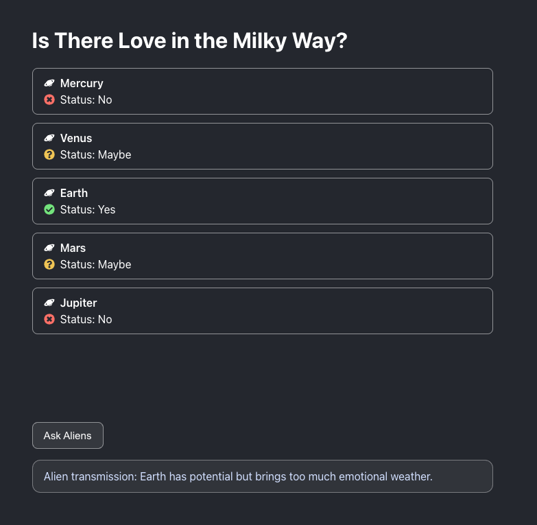

# [Is There Love in Space?](https://en.wikipedia.org/wiki/Is_There_Love_in_Space%3F)



## Run locally

Install dependencies:

```bash
npm install
```

Start the development server:

```bash
npm start
```

The app will be available at `http://localhost:3000`.

## Run tests

Run all tests:

```bash
npm test
```

Run one test file:

```bash
npm test -- --runTestsByPath src/Components/ListOfPlanets.test.js
```
